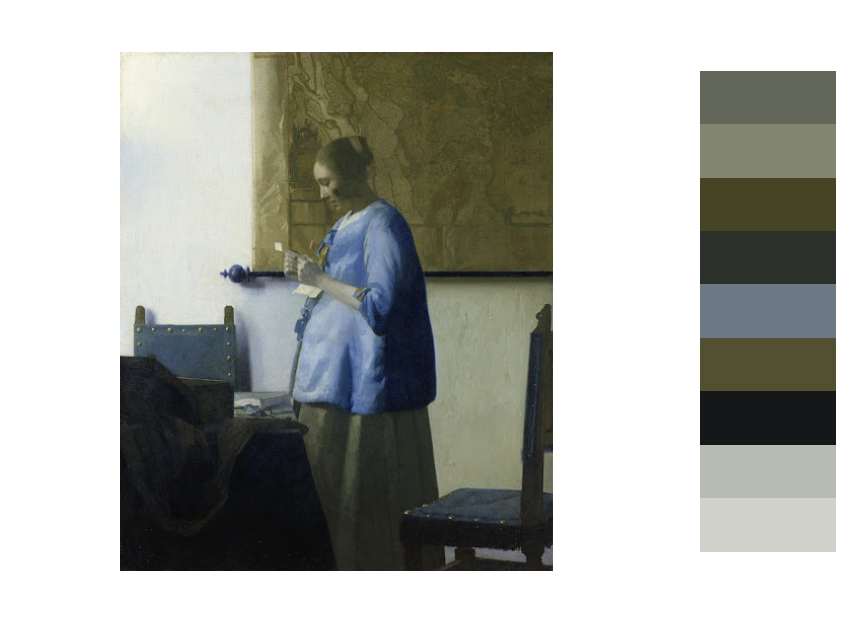

# rijkspalette

An R package to generate palettes based on famous paintings from the Rijksmuseum. This package uses the fantastic [Rijksmuseum API](http://rijksmuseum.github.io/). 


## installation
```R
devtools::install_github("vankesteren/rijkspalette")
```

## usage

Let's make a palette based on Vermeer's famous painting of a woman reading a letter.
```R
library(rijkspalette)
letter <- rijksPalette("Vermeer Letter")
letter
```


The colours show up immediately in the `R` console, but not very precisely because it only accepts 256 colours. Maybe we should look at the palette a bit better:

```R
plot(letter)
```


The palette still seems a bit dark. Luckily, we can select its brightness between 0 and 1! The default value is 0.5.

```R
letter <- setBrightness(letter, 0.8)
plot(letter)
```


That's better. Now let's use the two most relevant items inside this object:

```R
letter$cols
```

The extracted colours in hexadecimal format

```
[1] "#CDCFC8" "#8E9595" "#101113" "#4D4B2C" "#5B6570" "#232722" "#454324" "#5D604D" "#3A3C38"
attr(,"class")
[1] "character" "rijkscols"
```

And the palette object is a `colorRampPalette` function to be used in plots and such:
```R
barplot(1:15, col = letter$palette(15))
```


This can become practically continuous:


```R
barplot(rep(1,1500), col = letter$palette(1500), border = NA, space = 0, 
        axes = FALSE)
```


